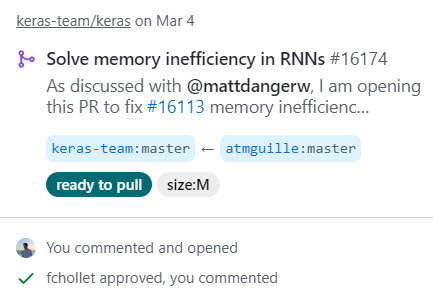

# Hi there, I'm Guille! 👋👨🏼‍💻

Computer Scientist and Mathematician eager to continue using Artificial Intelligence to improve people's lives around me.

### Languages

### ML/DL libraries

### Open-Source contributions

### Kaggle

